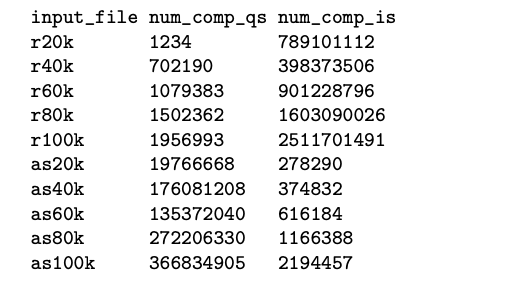

# Project 1: Quick Sort vs Insertion Sort

In this project, you will complete implementations of the quicksort and insertion sort algorithms.
You are given some starter code that handles the reading of inputs and printing of outputs. Your job is to complete the implementation of the following:
1. InsertionSort (InsertionSort.h and InsertionSort.cpp): Sort input and re- turn number of key comparisons the algorithm made for the input array.
2. QuickSort (QuickSort.h and QuickSort.cpp): Sort input and return num- ber of key comparisons the algorithm made for the input array. For the purpose of this project, you must partition using the 1st element as a pivot. That is, you always pick the pivot element to be the key from the 1st element of a subarray.
3. VerifySort (in VerifySort.h and VerifySort.cpp): Returns true if the input array is sorted, and false otherwise.
You will be required to count the number of comparisons (e.g. a ≤ b) made in the process of sorting the elements in the array. To ensure consistency (and to help with fair grading), follow these guidelines for counting the number of comparisons (let n be the size of the input array):
• insertion sort: the number of comparisons is equal to n plus the number of element swaps. This can be determined at runtime.
• quicksort: let m be the size of a subarray. You can add m − 1 for each recursive call on the subarray. This is because partition makes exactly m− 1 comparisons. Note that this means that a subarray of size 1 requires no comparisons (and this should make sense; an array with only one element is trivially sorted).

Make no other changes to the files other than completing the assigned methods. You may not use any of the tools provided in the STL other than those in STL vector (i.e. you may not call STL sort, or any other STL algorithm, but you may use vector::size() and vector::resize()). Remember to read the project guidelines before you start coding.

## Sample Inputs

You will be provided two sets of input: randomly generated integers (r20k, r40k, r60k, r80k, r100k) and almost sorted integers (as20k, as40k, as60k, as80k, as100k). Each input is a file containing integers line-by-line. These files provide convenient test inputs for you to use to ensure your solution works correctly before submitting to Mimir. Remember that you don’t have to worry about reading these files – the provided main.cpp handles this for you.
What follows is the ”correct” output for each of the provided test files. Note that you will not be graded on your program’s outputs for these inputs. They serve only to locally test your solution.



Where num comp qs is the number of comparisons made in the quicksort algorithm and num comp is the number of comparisons made in the insertion sort algorithm.

## Project Deliverables

1. QuickSort.h and QuickSort.cpp - contains your implementation of Quick- sort algorithm
2. InsertionSort.h and InsertionSort.cpp - contains your implementation of Insertion Sort algorithm
3. VerifySort.h and VerifySort.cpp - contains your implementation of Verify Sort algorithm

## Getting Started

These instructions will get you a copy of the project up and running on your local machine for development and testing purposes. See deployment for notes on how to deploy the project on a live system.

### Prerequisites

The things you need before installing the software.

* Visual Studio 2019 Community Edition
* C++ compiler (Homebrew Mac OS X)

### Installation and Execution

A step by step guide that will tell you how to get the development environment up and running.

```
$ Create directory from the name of the files
$ ls into desired directory you want to access downloaded files
$ make      @ Run Makefile to compile all files
$ ./Sort  ./input/FILENAME      @ Execute program 
```

## Usage

A few examples of useful commands and/or tasks.

```
192-168-1-102:Project1 jordanhybki$ ./Sort ./input/as20k.in
number of keys: 20000
QuickSort 
number of comparisons: 39998
time: 23 ms
Sorted
InsertionSort 
number of comparisons: 278290
time: 0 ms
Sorted 
```

```
192-168-1-102:Project1 jordanhybki$ ./Sort ./input/as40k.in
number of keys: 40000
QuickSort 
number of comparisons: 79998
time: 129 ms
Sorted
InsertionSort 
number of comparisons: 374832
time: 0 ms
Sorted 
```

```
192-168-1-102:Project1 jordanhybki$ ./Sort ./input/as60k.in
number of keys: 60000
QuickSort 
number of comparisons: 119998
time: 159 ms
Sorted
InsertionSort 
number of comparisons: 616184
time: 0 ms
Sorted 
```

```
192-168-1-102:Project1 jordanhybki$ ./Sort ./input/as80k.in
number of keys: 80000
QuickSort 
number of comparisons: 159998
time: 286 ms
Sorted
InsertionSort 
number of comparisons: 1166388
time: 0 ms
Sorted 
```

```
192-168-1-102:Project1 jordanhybki$ ./Sort ./input/as100k.in
number of keys: 100000
QuickSort 
number of comparisons: 199998
time: 247 ms
Sorted
InsertionSort 
number of comparisons: 2194457
time: 1 ms
Sorted 
```

```
192-168-1-102:Project1 jordanhybki$ ./Sort ./input/r20k.in
number of keys: 20000
QuickSort 
number of comparisons: 39998
time: 1 ms
Sorted
InsertionSort 
number of comparisons: 100436650
time: 49 ms
Sorted 
```

```
192-168-1-102:Project1 jordanhybki$ ./Sort ./input/r40k.in
number of keys: 40000
QuickSort 
number of comparisons: 79998
time: 3 ms
Sorted
InsertionSort 
number of comparisons: 398373506
time: 197 ms
Sorted 
```

```
192-168-1-102:Project1 jordanhybki$ ./Sort ./input/r60k.in
number of keys: 60000
QuickSort 
number of comparisons: 119998
time: 4 ms
Sorted
InsertionSort 
number of comparisons: 901228796
time: 464 ms
Sorted 
```

```
192-168-1-102:Project1 jordanhybki$ ./Sort ./input/r80k.in
number of keys: 80000
QuickSort 
number of comparisons: 159998
time: 6 ms
Sorted
InsertionSort 
number of comparisons: 1603090026
time: 819 ms
Sorted 
```

```
192-168-1-102:Project1 jordanhybki$ ./Sort ./input/r100k.in
number of keys: 100000
QuickSort 
number of comparisons: 199998
time: 8 ms
Sorted
InsertionSort 
number of comparisons: 2511701491
time: 1280 ms
Sorted 
```


