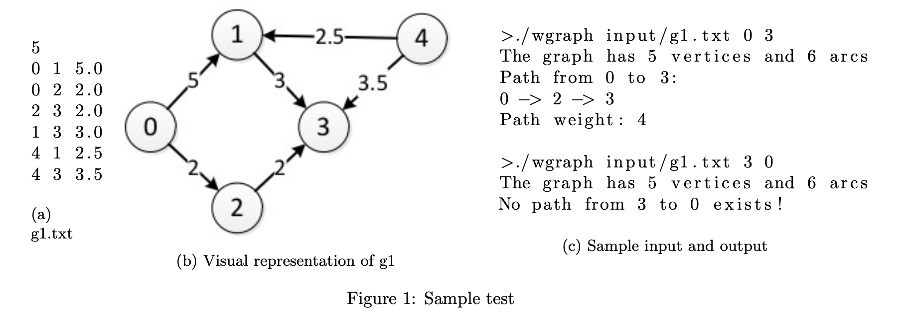

# Project 4: Weighted Digraphs

In this project, you will complete an implementation of a weighted directed graph, or digraph. You are given starter code (i.e., main.cpp) that reads inputs and prints outputs as well as a class declaration for a weighted digraph in WeightedDigraph.h and stub implementation in WeightedDigraph.cpp. Your job is to complete the implementation of the following methods in the WeightedDigraph class:
1. InsertArc: Adds an arc of the given weight between the two vertices. InsertArc should run in constant time.  Make sure you aren't using something like std::find which is logarithmic.
2. DoesPathExist: Checks whether a directed path exists between two vertices. Given the first vertex parameter u and the second v, this function does not test to see if there is just a single arc from u to v but a directed path from u to v.  As such, you will need to use a graph searching algorithm like dfs or bfs.  You may use your dfs implementation from project 3. DoesPathExist is const.  This means you are not allowed to alter any member variables of the WeightedDigraph.  Instead, you can use variables in the scope of the DoesPathExist function and alter those. For the DoesPathExist tests, DoesPathExist may be called more than once.  If you use any class member variables (not WeightedDigraph but another class, such as a Node class) you may need to clear those variables so they can be used again for the second call to DoesPathExist. For example, if you use a visited variable which keeps track of which vertices are visited in the search of the graph you should reset this variable after or before your call to DoesPathExist.
3. IsPathValid: Determines whether an arc exists along each step of the path.
4. GetPathWeight: Finds the sum weight of a directed path. You may assume that the input is a valid path.
5. FindMinimumWeightedPath: Finds a path of minimum sum weight between two vertices using Dijkstra’s algorithm. For your reference, Dijkstra’s algorithm can be found on page 392 of our textbook [Weiss, 2014] and in lecture 11. 
FindMinimumWeightedPath
You can use a priority queue to help select minimum weight edges to add to your path.  One easy way to do this is to use std::set.  A set is a sorted container.  Declare your set as std::set<pair<double, int>>, where the distance is the key and the vertex index is the value.  Set insertion takes O(log n) time. If you use std::sort or std::find instead of a priority queue, your function will take much longer and you may get a SIGPIPE error on Mimir for tests 4 and 5 and lose points.
It's good to check if an edge has already been visited before adding it to the priority queue. However, you may still have a vertex in the queue which has been visited. 
```
        Consider the graph

        0 1 2.0
        0 2 3.0
        1 2 1.0
        ...

        If you start at 0, first the queue is

        {{2.0, 1}, {3.0, 2}}

        then visit 1 and the queue is

        {{1.0, 2}, {3.0, 2}}

        then visit 2 and the queue is

        {{3.0, 2}, ...}

        See that v_2 is still in the queue even though it has been visited. In this case, you would want to pop this pair off of the queue without processing it and continue your search for the minimum path.
```


## Implementation details

• Digraph storage
You may use any classes from the STL that you need to store your digraph. For example you can use vector<map<int,double>> or vector<vector<pair<int,double>>>. You may modify the constructor and destructor to initialize and clean-up these structures. Note that the constructor uses InsertArc to set up the graph. You should ensure that your structure is properly initialized before calling InsertArc.
• Digraph immutability
InsertArc is the only method that is not marked const and it is a private method. As such, once constructed, your digraph will be immutable. You will lose points if you modify the digraph declaration such that it is not immutable.
• Time and memory requirements
Let V be the set of vertices and A the set of arcs for an input digraph. Your digraph memory requirements must be O(|V | + |A|)• InsertArc must run in constant time. GetPathWeight and IsPathValid should run in time linear in the length of the input list. Each of them should use a fixed amount of extra memory. DoesPathExist should use at most O(|A|) time and O(|V |) extra memory. FindMinimumWeightedPath should use O(|A| log |V |) time and O(|V | + |A|) extra memory.
• Input assumptions
You may assume that there are no negative weights in the digraph. You may assume that the input paths for GetPathWeight and IsPathValid are non-empty (contain at least two vertices). You may not assume that all of the arcs in the path exist. You may assume that FindMinimumWeightedPath will only be called if a path exists.
• Testing notes
Not all of the above methods are directly tested by the supplied test harness in main.cpp described in the next section. However, you will probably want to use the untested methods to implement the tested ones. It is your responsibility to ensure that all of the required methods work properly.

## Testing with main.cpp

The program has three inputs.
1. The first is a file containing the digraph.
• The first line of the file contains the number of vertices in the graph.
• Each remaining line contains three values separated by spaces which represent an arc. The first is the source vertex for the arc. The second is the destination vertex of the arc. The third is the arc weight.
2. The second is the source vertex index.
3. The third is the destination vertex index.
The main.cpp first constructs a digraph from the input file. Next, it will determine if a path from the source vertex to the destination vertex exists. If so, it will find such a path of minimum weight and compute its weight. Please see Figure 1 for a sample test.


## Project Deliverables

The following files must be submitted to Mimir no later than 11:59 pm April 19, 2020.
1. WeightedDigraph.h - contains the declaration for the WeightedDigraph class.
2. WeightedDigraph.cpp - contains your implementation of the WeightedDigraph class.

## Getting Started

These instructions will get you a copy of the project up and running on your local machine for development and testing purposes. See deployment for notes on how to deploy the project on a live system.

### Prerequisites

The things you need before installing the software.

* Visual Studio 2019 Community Edition
* C++ compiler (Homebrew Mac OS X)

### Installation and Execution

A step by step guide that will tell you how to get the development environment up and running.

```
$ Create directory from the name of the files
$ ls into desired directory you want to access downloaded files
$ make      @ Run Makefile to compile all files
$ ./wgraph ./input/FILENAME VERTICIES ARCHES   @ Execute program 
```

## Usage

A few examples of useful commands and/or tasks.


